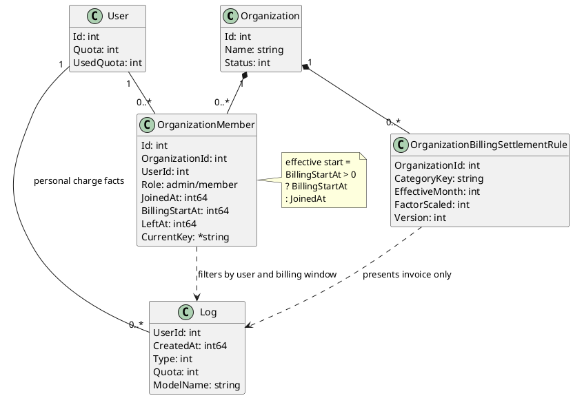

# 数据模型

组织查询、接口和日志聚合细节见 [组织与组织账单架构设计](./组织与组织账单架构设计.md)。

基础组织与 Billing 数据模型已随产品上线；以下结构和约束是包含历史归属起点与 Invoice 候选能力的当前实现合同。发布状态以 [组织与账单上线进度](../50-planning/组织与账单上线进度.md) 为准。

## 个人账单主体

现有个人账号仍是真实扣费主体：

- `users.quota`：个人剩余额度。
- `users.used_quota`：个人已用额度。
- `users.request_count`：个人请求次数。
- `users.group`：用户分组、模型可用性、路由和倍率维度，不是组织。
- `tokens.user_id`：Token 归属个人用户。
- `logs.user_id`：消费事实归属个人用户。

组织扩展不改变这些字段的语义。

## 组织模型

组织只表达组织空间、成员关系、角色和报表权限。

```go
type Organization struct {
    Id        int
    Name      string
    Status    int
    CreatedAt int64
    UpdatedAt int64
}

type OrganizationMember struct {
    Id             int
    OrganizationId int
    UserId         int
    Role           string // admin / member
    JoinedAt       int64
    LeftAt         int64  // 0 表示当前仍有效
    BillingStartAt int64  // 0 表示兼容旧行，读取时回退 JoinedAt
    CurrentKey     *string // 活动关系保存用户 ID，历史关系为 NULL
}

type OrganizationBillingSettlementRule struct {
    Id             int
    OrganizationId int
    CategoryKey    string
    EffectiveMonth int // 北京时间 YYYYMM
    FactorScaled   int // 结算系数 × 10,000
    Version        int
    CreatedAt      int64
    UpdatedAt      int64
}
```

`OrganizationMember` 是用户加入组织的唯一事实来源。`users` 表不增加当前组织字段，Token、Header、请求参数和 `group` 都不表达组织归属。

创建组织只创建 `Organization`，不创建成员关系。系统管理员后续通过成员接口添加 Admin 或 Member。

### 关系图



## 成员关系约束

- 一个用户同一时间只能属于一个组织。
- 当前有效成员使用 `left_at = 0` 表达。
- 新成员由业务代码写入 `billing_start_at = joined_at`；功能上线前的旧行保留零值并在读取时回退 `joined_at`，避免迁移后账单自动变化。
- `joined_at` 是成员关系审计事实，`billing_start_at` 是组织报表归属起点，两者不得混用。
- 添加成员必须在事务中检查该用户没有其他 `left_at = 0` 的成员关系。
- `current_key` 可空唯一索引处理并发竞争，不依赖跨数据库部分索引。
- 组织可以处于无成员状态，此时只有系统管理员能继续维护该组织。
- 移除成员设置 `left_at`，不物理删除成员关系。
- 当前操作者可以移除自己，但移除或降级后必须至少保留一个活动 Admin。
- 添加、移除和角色变更通过组织行锁串行化，并在同一事务中维护最后一个 Admin 不变量。

跨数据库约束不能依赖部分索引。SQLite、MySQL、PostgreSQL 通过事务检查和 `current_key` 可空唯一索引共同保证当前有效成员唯一性。

历史归属起点只能显式向前调整。应用时锁定组织和当前成员记录，校验 `expected_billing_start`、候选时间及同组织内该用户其他成员窗口不重叠；跨组织窗口允许重叠。该限制防止同一日志在同组织的多段关系中重复统计。

## 组织账单口径

组织账单从现有个人消费日志聚合，不新增独立组织流水表。

```text
Organization
  -> OrganizationMember.UserId
  -> Log.UserId
  -> group by member / model / channel / time
```

成员有效期过滤规则：

- `effective_billing_start = billing_start_at > 0 ? billing_start_at : joined_at`
- `Log.CreatedAt >= effective_billing_start`
- `OrganizationMember.LeftAt = 0` 或 `Log.CreatedAt < OrganizationMember.LeftAt`

查询需要兼容主库日志、独立日志库和 ClickHouse 场景，不能假设组织表与日志表可以跨库 join。实现上先从主库读取成员及有效期，再到日志库按 `user_id`、时间窗口、日志类型、模型和渠道过滤。

## 组织结算规则

`OrganizationBillingSettlementRule` 只影响组织 Invoice 展示，不进入个人扣费链路：

- 唯一键为 `organization_id + category_key + effective_month`。
- `category_key` 使用 `varchar(96)`；已知模型使用稳定前缀类别，未知模型使用 `model.` 加规范化模型名的 SHA-256 摘要。
- `factor_scaled` 允许 `0` 至 `100000`，分别表示 `0.0000` 至 `10.0000`；未配置时回退 `10000`。
- 规则按北京时间自然月版本化；账期跨月时逐月选取 `effective_month <= 目标月份` 的最新规则。
- `version` 从 1 开始并用于更新 CAS；相同系数重复提交不递增版本。
- 规则表通过 GORM 迁移创建，不使用数据库专属 JSON、生成列或部分索引。

## 明确不建模

已上线版本明确不引入：

- 组织余额。
- 组织充值。
- 组织订阅。
- 组织付款客户 ID。
- 组织预扣费、补扣、退款。
- 组织 API Key。
- Token 与组织绑定。
- 请求 Header 或请求参数中的组织归属。
- 独立 `OrganizationUsage` 流水。
