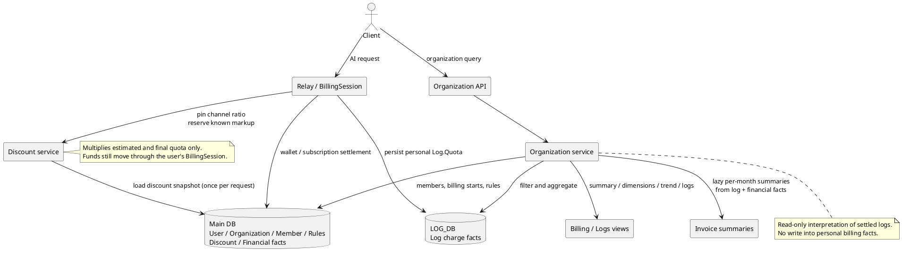
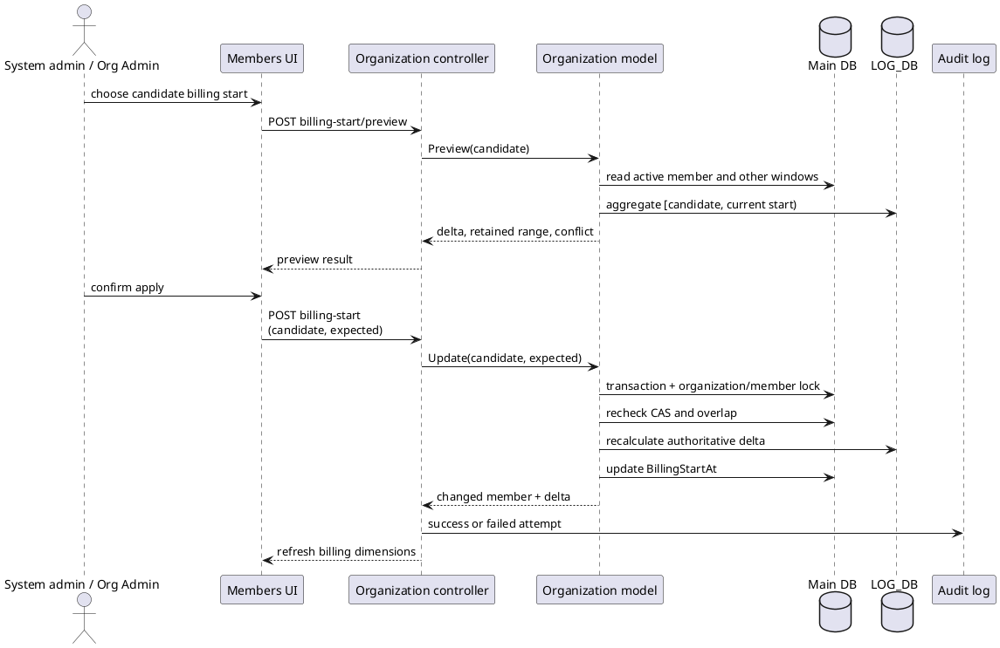

# 组织与组织账单架构设计

## 设计边界

组织模块是个人账号体系之上的扩展，包含两个与个人计费的接触面：

```text
扣费链路：Relay -> Token -> User -> BillingSession -> Wallet/Subscription -> Log
折扣接触面：组织渠道折扣作为计价乘数进入扣费链路（请求开始固定快照，复用 BillingSession 预扣/结算）
统计接触面：OrganizationMember -> Log.UserId -> Summary/Dimension/Trend/Logs/Invoice
```

- 组织不参与请求鉴权、渠道选择、充值或订阅，没有组织级资金路径：预扣、结算、退款始终由用户自身的 `BillingSession` 执行，组织渠道折扣只是计价阶段的额外乘数。
- 统计链路消费已经落库的 `Log` 与主库财务事实，不改写任何账务事实；Invoice 月度汇总只写入可删除、可重建的派生缓存，不是权威余额快照。



## 运行状态

基础组织架构已上线运行。组织渠道折扣、Invoice 全部账户与月度财务汇总已完成实现、迁移接入和自动化验证；MySQL、PostgreSQL 实库验证、ClickHouse 分支和生产规模压测仍是发布门槛。

## 个人计费真源

### 账单主体

- `User.Quota`、`UsedQuota` 为 `int64`，`RequestCount` 表达个人钱包和累计用量。
- `Token.UserId` 把 API Key 绑定到个人用户；`Token.RemainQuota`、`Token.UsedQuota` 为 `int64`，Token 自身可限制剩余额度并记录已用额度，但不是付款主体。
- `TopUp`、`Redemption` 表达充值订单和兑换码充值。
- `SubscriptionPlan`、`SubscriptionOrder`、`UserSubscription` 表达套餐、购买订单和用户订阅实例。
- `BillingSession` 在 `wallet` 与 `subscription` 两类资金来源之间执行预扣、结算和退款。

### 计费规则

系统支持倍率计费、固定价格/按次计费和 `tiered_expr` 表达式计费。工具调用和异步任务也可以形成附加费用。

组织账单不重新运行这些计算，而是把 `Log.Quota` 作为历史消费事实。日志中的当次计费元数据优先用于解释；当前 `Pricing` 只提供模型倍率、固定价格或表达式的现状快照。

## 组织渠道折扣

决策记录与取舍见 [ADR-0002: 组织渠道折扣](./decisions/0002-组织渠道折扣.md)。本节只描述当前实现合同。

### 领域模型

每个组织只有一份当前折扣配置，按渠道独立表达折扣或加价：

```text
最终计费 = 现有基础计费 × 现有全局渠道倍率 × 组织渠道折扣
```

- `Organization.CurrentDiscountSnapshotId` 是当前配置的唯一权威，同时作为保存时的乐观锁令牌。
- `OrganizationDiscountSnapshot` 是追加式不可变快照：`ChannelDiscounts` 以跨数据库兼容的 `TEXT` 保存 JSON 映射，键为渠道 ID，值为定点整数倍率（缩放基数 `1_000_000`）。
- 倍率值域为 `(0, 10)`，六位小数精度下最大 `9.999999`；`0.8` 表示按原价 80% 收费，`1.5` 表示按 150% 收费。值域校验收敛在 `model.ValidateOrganizationDiscountRatioScaled` 单一边界。
- `1.0` 在保存时归一化为未配置；空映射表示组织无渠道折扣；序列化上限 65,535 字节，超限保存前拒绝。
- 无名称、无状态机、无生效区间、无组织全局倍率；历史快照只追加，按 `Id DESC` 分页并与上一份快照比较派生变更。

### 请求计费流程

```text
请求首次计费解析
  -> LoadOrganizationDiscountSnapshot 一次性读取完整快照，固定在 PriceData.DiscountSnapshot
  -> 渠道确定后 PinChannel 钉住实际渠道倍率（只查内存映射，未配置为 1.0）
  -> 预扣、重试、结算、退款不再访问折扣数据库
```

- `PriceData.QuotaToPreConsume` 保存未应用组织倍率的预估额度，`PriceData.Quota` 保存应用实际渠道倍率后的最终额度；`OtherRatios`（时长、分辨率等）对两个值独立生效，不得从彼此反推。
- 预扣目标为 `QuotaToPreConsume × max(1, 当前渠道组织倍率)`：倍率小于等于 `1` 按原价预扣，大于 `1` 按加价后预估预扣；最终费用始终按实际用量结算，多退少补。
- 首次加载或解析失败必须阻断请求，不得降级为默认 `1.0`；管理员在请求期间保存新折扣只影响之后首次解析计费的请求。

### 预扣接入点

预扣补足只复用现有 `BillingSession.Reserve`，不新增组织折扣专用资金路径：

| 路径 | 接入点 | 行为 |
| --- | --- | --- |
| 非分层同步（含 WSS） | `controller/relay.go` 在 `ApplyOrganizationDiscountForChannel` 之后、调用上游之前调用 `PrepareOrganizationDiscountReservation` | 目标更高时 Reserve，失败则拒绝请求 |
| 分层计费 | 既有 `PrepareTieredBillingForSelectedGroup` 入口 | 组织倍率纳入该入口的目标额度，非分层接点跳过分层请求，避免重复 Reserve |
| 统一异步任务 | `PrepareTaskBillingForAttempt`（`relay/relay_task.go`） | 每次上游尝试校准目标：首次 `PreConsume(target)`，跨渠道重试复用同一会话只 Reserve 更高目标 |
| Midjourney | 不接入 | MJ 当前未使用，倍率值域属于组织配置统一规则，但 MJ 预扣行为未承诺 |

渠道重试始终从未应用组织倍率的原始预估基数计算新目标，不得在上一次倍率结果上继续相乘；重试切换渠道时从原请求内存快照解析新渠道倍率，不重新读取组织当前配置。

### 异步任务与审计

- `TaskBillingContext` 以组织折扣快照命名，只持久化快照 ID、实际渠道 ID 和已应用倍率，不保存完整渠道映射；轮询结算、失败退款和 token 差额只使用提交时事实。
- `Log.Quota` 记录已应用折扣的最终额度，Invoice 直接聚合 `Log.Quota` 不再二次折扣；管理员日志 `admin_info.organization_discount` 记录 `snapshot_id`、`channel_id`、`ratio`。
- 钱包信任旁路保持 new-api 原有语义：命中信任不实际预扣、不补扣，最终由结算 journal 按实际费用扣费。已接受取舍是组织倍率可能把信任钱包的授信敞口放大到接近 10 倍，但不改变最终账单金额。

### 管理 API 与权限

折扣是 Root 专属能力，独立挂载 `RootAuth()` 路由组，不进入 `AdminAuth()` 组织管理组（`router/api-router.go`）：

```text
GET /api/admin/organizations/:id/discount                   当前配置（无快照返回 snapshot_id=0）
PUT /api/admin/organizations/:id/discount                   完整批量替换
GET /api/admin/organizations/:id/discount/history           不可变快照分页
GET /api/admin/organizations/:id/discount/channel-options   全局渠道轻量选项
```

保存为单事务完整替换：追加新快照并以 `WHERE current_discount_snapshot_id = expected_snapshot_id` 条件更新组织指针，`RowsAffected != 1` 回滚并返回 `409`；首次保存使用 `expected_snapshot_id = 0`。普通 Admin 直接请求得到 `403`，前端折扣页签按 Root 隐藏。

## 组织数据模型

```go
type Organization struct {
    Id                         int
    Name                       string
    Status                     int
    CurrentDiscountSnapshotId  int    // 当前组织折扣快照，0 表示未配置
    CreatedAt                  int64
    UpdatedAt                  int64
}

type OrganizationMember struct {
    Id             int
    OrganizationId int
    UserId         int
    Role           string
    JoinedAt       int64
    LeftAt         int64
    BillingStartAt int64
    CurrentKey     *string
}

type OrganizationBillingSettlementRule struct {
    Id             int
    OrganizationId int
    CategoryKey    string
    EffectiveMonth int
    FactorScaled   int
    Version        int
    CreatedAt      int64
    UpdatedAt      int64
}

type OrganizationDiscountSnapshot struct {
    Id               int    // 主键，兼作历史顺序与并发令牌
    OrganizationId   int    // 普通索引
    ChannelDiscounts string // TEXT JSON，键为渠道 ID，值为定点整数倍率
    CreatedBy        int
    CreatedAt        int64
}
```

### 字段语义

- `Status` 当前支持 enabled/disabled，用于管理列表、标记和筛选；当前代码没有用 disabled 阻断成员查询或 API 消费，不能把它描述为强制停用开关。
- `JoinedAt` 包含在有效期内，`LeftAt` 是排他的结束时间；`LeftAt = 0` 表示当前活动。
- `BillingStartAt` 是组织报表归属起点；新成员写入 `JoinedAt`，旧行零值在读取时回退 `JoinedAt`。它不改变真实加入时间或个人扣费归属。
- `CurrentKey` 对活动关系保存用户 ID 字符串，历史关系置空。
- `OrganizationBillingSettlementRule` 保存组织、模型类别、北京时间生效月、四位定点系数和乐观锁版本；`CategoryKey` 使用 `varchar(96)` 并与组织、生效月组成唯一索引。
- `Username`、`DisplayName`、`Email` 是查询时回填字段，不持久化。

### 活动关系唯一性

系统使用双重约束保证一个用户同一时间只属于一个组织：

1. 事务内检查 `user_id = ? AND left_at = 0`。
2. `current_key` 使用可空唯一索引；活动关系写入用户 ID，离开时置为 `NULL`。

该方案不依赖部分索引，适用于 SQLite、MySQL 和 PostgreSQL。事务检查提供清晰业务错误，唯一索引处理并发竞争。

读取当前组织时最多读取两条活动关系；若历史坏数据绕过唯一键形成多条活动关系，接口直接报错，不任意选择第一条。

### 角色不变量

- 创建组织不会自动创建成员。
- 组织成员角色只接受 `admin`、`member`。
- 旧数据中的 `owner` 在迁移时归一为 `admin`，`billing` 归一为 `member`。
- 当前成员可以移除自己；移除或降级组织内最后一个活动 `admin` 会在成员变更事务内被拒绝，避免组织落入无活动管理员、普通成员无法自恢复的状态。
- 添加、移除和角色变更先锁定组织行，使最后一个 Admin 校验与成员写入在 SQLite、MySQL、PostgreSQL 上保持同一事务边界。

## 权限模型

用户侧路由使用 `UserAuth`，管理员路由使用 `AdminAuth`。组织内权限由活动成员角色判断：

- Admin：`UserCanManageOrganization`，可修改组织及维护成员、查看完整 Billing/Invoice 并配置结算系数。
- Member：后端允许调用 Billing/Logs，但强制覆盖 `filters.UserId` 为当前用户；Invoice 与规则接口拒绝 Member。
- 渠道可见性：仅 Admin 和系统管理员可查看渠道维度。Member 的账单范围建立后，`filters.ChannelId` 被后端强制清零；`/api/organization/current/billing/channels` 返回空数组；日志 JSON、原始日志 CSV 和完整账单 CSV 均不包含渠道字段或渠道用量区块。前端 `canViewOrganizationBillingChannels(role)` 仅控制 UI，最终边界由后端强制。

所有用户侧账单接口都使用 `current` 语义，由登录用户的唯一活动成员关系推导组织 ID；客户端不能提交任意组织 ID。

## 账单查询口径

### 成员有效期

每段成员关系独立形成日志窗口：

```text
effective_billing_start =
  billing_start_at > 0 ? billing_start_at : joined_at

created_at >= max(effective_billing_start, start_timestamp)
created_at < left_at               # 已离开时
created_at <= end_timestamp        # 查询结束时间
```

同一用户离开后重新加入会形成多个成员记录，聚合时逐段累加，不把组织外期间计入。

### 历史归属起点预览与应用

系统管理员和组织 Admin 可以把当前成员的 `BillingStartAt` 向前扩展，以纳入仍保留在日志库中的加入前消费。该能力固定复用默认消费日志口径，并遵守以下约束：

- 候选起点必须大于零、不得位于未来、不得晚于当前生效起点。
- 预览只读，计算差集 `[candidate, current_effective)` 内新增请求数、quota、Token、最早/最晚日志，并返回该用户最早保留日志时间。
- 应用请求必须携带预览读取到的 `expected_billing_start`。服务端在事务内锁定组织和成员记录，重做 CAS、候选校验、同组织窗口不相交校验和增量计算。
- 同值重应用返回幂等成功；实际变更写成功审计，CAS、窗口冲突或非法候选写失败审计。
- 当前接口只允许向前扩展，不支持把起点调晚。错误回填不能通过同一 API 撤销，发布前必须保留备份并按[运维手册](../40-operations/运维手册.md)处理。



### 日志类型

- 默认：`LogTypeConsume`。
- `type`：显式选择单一日志类型。
- `view=reconciliation`：消费、退款、系统调整三类分列查询范围。
- `include_refund=true`、`include_adjustment=true`：在默认消费口径上追加类型。

当前前端没有暴露对账模式，界面默认使用消费口径。

### 筛选条件

所有聚合与明细共用：

- `start_timestamp` / `end_timestamp`
- `user_id`
- `model_name`
- `channel`
- 日志类型参数

模型名通过显式文本过滤器处理，渠道按 ID 过滤。前端日期边界按北京时间 00:00:00 至 23:59:59 生成。

## 聚合实现

组织关系在主库，日志可能位于主库、独立日志库或 ClickHouse，因此禁止依赖跨库 join：

```text
主库读取成员及有效期
  -> 对每段成员关系在 LOG_DB 应用相同过滤
  -> 日志库聚合
  -> Go 合并结果并回填用户/渠道信息
```

### 返回视图

- Summary：总 quota、请求数、输入/输出 token、历史成员数、活动成员数；页面和导出据总 quota 生成消费金额。
- Members：按用户汇总并回填用户名、显示名，同时展示聚合消费金额。
- Models：按模型汇总消费金额，并附加当前价格快照作为“当前计价规则”。
- Channels：按渠道汇总并回填渠道名，同时展示聚合消费金额。
- Trend：日志库对 Unix 秒加 8 小时后按日 bucket 聚合，再跨成员合并，确保日期是北京时间自然日。
- Logs：按成员游标进行全局倒序归并，稳定次序为 `created_at` 加日志 ID；ClickHouse 使用 request ID。ClickHouse 模式下返回的 `Id` 为分页序号（`assignDisplayLogIds`），与系统其他日志查询一致。

维度结果按 `total_quota`、请求数及维度键稳定排序；`total_quota` 等聚合字段使用 `int64`，以容纳跨成员/长账期的 `SUM(quota)`。回填用户或渠道失败会记录系统错误并降级返回，不影响账单主结果。

### 性能边界

当前实现避免把全部日志加载到 Go 内存：趋势在日志库聚合，明细使用每成员游标和批量续取。但查询数量仍随成员关系段数增长，大组织需要通过压测决定是否增加可移植的批量条件或账单快照。

`QuotaData` 等预聚合数据不能成为唯一真源，因为它们无法天然保证成员有效期和实时筛选口径。

### 性能与 Invoice 的关系

Billing 各视图（Summary/Members/Models/Channels/Trend/Logs）仍是查询时在日志库聚合。Invoice 不走这条路径：日常查询只读派生月度汇总，原始事实聚合由后台任务执行（见下节）。当前 `LOG_DB` 与主库没有物理隔离，第一阶段接受同库受限后台惰性汇总，并保留后台执行、独立并发限制、查询超时与取消，不把重聚合放回 HTTP 同步路径。

## Invoice 月度账单

Invoice 的业务目标是让每个账户在账期内满足余额闭合：

```text
期初余额 + 全部入账 - 全部扣减 = 期末余额
```

原始业务事实（充值订单、管理员调额、消费/退款日志、订阅订单）是真相；月度汇总是可删除、可按计算版本重建的派生缓存，不是权威余额快照，也不是中心化钱包流水。

### 按需月度汇总

汇总按“组织 + 期间 + 计算版本”唯一定位（`organization_invoice_period_summaries`，当前 `calculation_version = 4`）。自然月账单按月保存，跨月查询逐月读取并组合，非自然月边界作为独立期间片段保存。`Revision` 在同口径内递增，`Status` 为 `building / ready / failed / invalidated`。

生成流程：

```text
用户查询组织某月 Invoice
  -> 读取目标月与期初计算所需的 ready 汇总
  -> 缺少月份或版本过期？
       ├─ 否 -> 直接组合已发布 payload 返回
       └─ 是 -> 以唯一索引争夺生成权，入后台队列，HTTP 返回 generating
                  -> 后台批量读取原始事实，原子发布 ready payload
```

- HTTP 首次查询只获取生成权并返回 `generating`；原始事实查询进入单并发后台队列，60 秒超时，重复请求复用同一任务，不同步回退原始日志扫描。
- `building` 超过 2 分钟视为过期可重新认领；`failed` 有 30 秒失败退避；payload 只在完整构建成功后一次性发布，Invoice 读不到部分账户已完成、部分未完成的中间状态。
- 后台按时间顺序每次只生成第一个缺失月份，页面轮询推进下一个缺失月份；目标月依赖的历史月全部 ready 后才生成目标结果。
- 开放账期以统一 `source_as_of` 一次性计算；显式刷新（`refresh=1`）一次失效请求范围内的全部期间再按月重建。开放账期结果在账期结束后的首次查询自动重建为 finalized 版本。
- 后台聚合不使用 `FOR UPDATE`，不在长事务内生成 CSV；主库的用户余额、充值、调额事实在同一短读事务中读取（MySQL/PostgreSQL repeatable-read）。
- 汇总缺失或生成失败时明确返回生成中或错误，不得静默回退到同步全量日志查询。

### 账户范围

Invoice 覆盖账期内与组织存在归属交集的全部账户，由独立账户范围模块（`model/organization_invoice_account_scope.go`）输出：

- 成员关系计费窗口与选定账期存在时间交集的全部用户，包含零消费、未登录、只入账未消费和账期内已离开的账户；多段成员关系只展示一次。
- 消费严格按成员计费窗口归属；财务事实按全部组织成员区间选择唯一归属：优先归属事实发生时覆盖该用户的成员区间，无覆盖时才归属最近的后续成员区间。离开组织后（`created_at >= LeftAt`）的事件不进入原组织，同一事实不跨组织重复。

### 财务事实与闭合

每个账户的财务摘要（`OrganizationInvoiceAccountFinancials`）在汇总构建时以 `int64 quota` 独立计算，最后才换算 USD 字符串；页面 JSON 与 CSV 共用同一 DTO，CSV 只负责格式化：

| 方向 | 来源 |
| --- | --- |
| 支付充值 | `topups.credited_quota`（Stripe、Epay、Creem、Waffo、Waffo Pancake 和管理员补单在实际入账时保存的实际 quota；禁止用当前 `QuotaPerUnit` 重算历史 USD） |
| 管理员增加 | 结构化 `user_quota_adjustments`（`delta_quota > 0`）+ 已核验历史事实与旧审计格式兼容（见下文） |
| 其他入账 | 兑换码、签到/邀请奖励等已确认正向来源；无结构化事实的来源（如旧版受邀注册奖励）保守标记 `incomplete`，不用当前配置反推历史金额 |
| 钱包消费 | `logs.billing_source` 为钱包来源的 AI 消费；订阅额度消费不进入钱包扣减 |
| 管理员扣减 | `user_quota_adjustments`（`delta_quota < 0`） |
| 其他扣减 | 钱包购买订阅（`subscription_orders.charged_quota`）等已识别扣减 |

退款按正数 `LogTypeRefund` 归入正向入账，负数 `LogTypeConsume` 继续视为异常并失败关闭。

闭合状态（`reconciliation_status`）：

| 状态 | 含义 |
| --- | --- |
| `generating` | 缺少所需汇总，后台正在生成 |
| `derived` | 历史期末由基线和事实汇总推导，没有独立余额观测 |
| `reconciled` | 独立观测余额与记录事实差异为零 |
| `incomplete` | 差异非零、源事实不完整或汇总异常 |

对账差异独立汇总入账与扣减事实计算，不使用“先反推扣减再校验”的恒等零公式。存在负数总入账、负数总扣减、负数其他扣减或溢出时直接标记 `incomplete`。任一账户仍为 `incomplete` 时月度汇总标记 `failed` 且不发布 payload，CSV 不会导出占位零期初。

“当前余额”在每次查询/导出时仅批量读取 `users.quota` 刷新，不因复用历史月汇总而变成过期值，也不触发原始日志扫描。

### 期初基线与历史调额事实

- 组织基线表（`organization_invoice_baselines`）保存组织的账务起算月；账户基线表（`organization_invoice_account_baselines`）保存每个账户在起算月的真实期初额度。系统不硬编码统一首账期。
- 基线由后台汇总任务在缺失时自动构建：使用目标账期的账户归属范围，回放账期开始前的已识别入账和扣减事实，在同一事务写入组织基线与全部账户期初；唯一索引保证多实例竞争下只有一份结果。历史事实不完整或回放得到负期初时不保存。
- 后续月份的期初 = 账户起算余额 + 起算月至上月的各月净变动累加，不依赖不可修正的“上月期末快照”；某月事实修正时该月及之后的已发布 payload 一并失效，各月按自身事实惰性重建。
- 上线前的旧管理员调额没有结构化流水。历史事实表 `user_quota_adjustment_legacy_facts` 以源日志 ID 唯一约束保证幂等，保存复核人信息；`v4` 汇总构建在结构化调额之外精确兼容旧 `user.quota_add` 审计事实和更早的“管理员增加用户额度”中文审计事实，已固化事实与带结构化调额 ID 的日志跳过避免重复计入，格式异常失败关闭。该兼容查询只在基线或汇总缺失、版本升级时的后台构建中执行，日常查账只读 ready 汇总。
- 历史调额可选固化能力收口为接收组织、账期和复核人的受控业务入口，校验复核人存在、启用且有权限；命令行工具（`cmd/organization-invoice-adjustment-backfill`）只保留预览和可选固化，不是查账前置条件。

### 模型分类与结算

消费按 `user_id + model_name + 北京时间月份` 聚合进入月度汇总 payload；月份通过 Unix 边界 `CASE` 表达式生成，不依赖数据库时区函数。权威分类目录位于 `model/organization_invoice_category_catalog.go`。它在包初始化时把确认清单构建为“规范化完整模型名 → 类别”索引，并拒绝归一化后重复归属；`organization_invoice.go` 的 Invoice 汇总和已使用类别查询只调用同一分类入口。规范化固定为 `TrimSpace + strings.ToLower`，分类先查完整模型名，再按目录中显式声明的无歧义家族前缀匹配，不使用任意子串推断。

| 排序 | 类别键 | CSV 基础名 | 精确模型 | 明确家族前缀 |
|---:|---|---|---|---|
| 10 | `claude` | Claude | `claude-fable-5`、`claude-sonnet-5`、`claude-opus-5`、`claude-opus-4.8`、`claude-opus-4.7`、`claude-opus-4.6`、`claude-sonnet-4.6`、`claude-haiku-4.5` | `claude-` |
| 20 | `gpt` | GPT | `gpt-5.6-sol`、`gpt-5.6-terra`、`gpt-5.6-luna`、`gpt-5.5`、`gpt-5.4`、`gpt-image-2`、`gpt-5.3-codex` | `gpt-`、`chatgpt-` |
| 30 | `gemini` | Gemini | `gemini-3-flash-preview`、`gemini-3.1-pro-preview`、`gemini-3.5-flash`、`gemini-3.6-flash` | `gemini-` |
| 40 | `minimax` | Minimax（阿里云） | `MiniMax-M3`、`MiniMax-M2.7`、`MiniMax-M2.7-Highspeed` | `minimax-` |
| 50 | `deepseek` | Deepseek | `deepseek-v4-flash`、`deepseek-v4-pro` | `deepseek-` |
| 60 | `kimi` | Kimi（阿里云） | `Kimi-3`、`Kimi-2.6`、`Kimi-2.7-code` | `kimi-`、`moonshotai/kimi-` |
| 70 | `glm` | GLM（阿里云） | `glm-5.2`、`glm-5.1`、`glm-5` | `glm-`、`chatglm-`、`chatglm_` |
| 80 | `qwen` | Qwen（阿里云） | `qwen3.7-max`、`qwen3.7-plus` | `qwen` |
| 90 | `vector` | 向量 | `text-embedding-3-large`、`text-embedding-3-small`、`text-embedding-v4`、`ctg-ac-ultra-latest`、`ctg-og-ultra-latest` | `text-embedding-` |

未命中精确清单和明确家族前缀的未知模型使用 `model.` 加规范化模型名 SHA-256 十六进制摘要作为稳定类别键，并保留日志中的原始模型名作为展示名。账期内每个类别按月份解析当月有效规则，未命中时统一回退 `1.0000`，再按“类别月 quota × FactorScaled / 10000”累加结算金额。分类目录不保存财务参考系数，也不生成或迁移规则；所有金额使用 decimal，负消费 quota、负结算金额和 int64 累加溢出直接拒绝。

规则首次创建和更新均在事务内锁定组织行；精确规则更新使用显式 `version` CAS。相同系数视为幂等，不升级版本、不重复成功审计；冲突返回 HTTP 409，并记录期望/实际版本。系数允许 `0.0000` 至 `10.0000`，零值是显式免费/结算豁免。

## API 契约

### 用户侧

```text
GET    /api/organization/self
GET    /api/organization/current
PATCH  /api/organization/current
GET    /api/organization/current/members
POST   /api/organization/current/members
PATCH  /api/organization/current/members/:user_id
DELETE /api/organization/current/members/:user_id
GET    /api/organization/current/billing/{summary,members,models,channels,trend,logs}
GET    /api/organization/current/billing/logs/export
GET    /api/organization/current/billing/logs/display-export
GET    /api/organization/current/billing/export
GET    /api/organization/current/invoice
GET    /api/organization/current/invoice/export
GET    /api/organization/current/invoice/settlement-rules
PUT    /api/organization/current/invoice/settlement-rules
POST   /api/organization/current/members/:user_id/billing-start/preview
POST   /api/organization/current/members/:user_id/billing-start
POST   /api/organization/current/billing/billing-start/preview-batch
```

### 管理员侧

```text
GET    /api/admin/organizations
POST   /api/admin/organizations
GET    /api/admin/organizations/:id
PATCH  /api/admin/organizations/:id
GET    /api/admin/organizations/:id/members
POST   /api/admin/organizations/:id/members
PATCH  /api/admin/organizations/:id/members/:user_id
DELETE /api/admin/organizations/:id/members/:user_id
GET    /api/admin/organizations/:id/billing/{summary,members,models,channels,trend,logs}
GET    /api/admin/organizations/:id/billing/logs/export
GET    /api/admin/organizations/:id/billing/logs/display-export
GET    /api/admin/organizations/:id/billing/export
GET    /api/admin/organizations/:id/invoice
GET    /api/admin/organizations/:id/invoice/export
GET    /api/admin/organizations/:id/invoice/settlement-rules
PUT    /api/admin/organizations/:id/invoice/settlement-rules
POST   /api/admin/organizations/:id/members/:user_id/billing-start/preview
POST   /api/admin/organizations/:id/members/:user_id/billing-start
POST   /api/admin/organizations/:id/billing/billing-start/preview-batch
```

组织折扣接口独立挂载 `RootAuth()`，仅 Root 可访问（普通 Admin 请求得到 `403`）：

```text
GET    /api/admin/organizations/:id/discount
PUT    /api/admin/organizations/:id/discount
GET    /api/admin/organizations/:id/discount/history
GET    /api/admin/organizations/:id/discount/channel-options
```

创建组织只接收名称；成员通过独立接口添加，角色只接受 Admin、Member。

## 导出与安全

组织 Billing/Logs 导出复用账单筛选和角色范围：

- `billing/logs/export`：严格保留既有单表日志 CSV、英文列名和 `organization-<id>-billing-logs.csv` 文件名，供旧客户端和排障流程使用。
- `billing/logs/display-export`：组织 Logs 页面使用的单表 CSV；列为北京时间、用户、模型、消费金额、币种、输入 Token、输出 Token。
- `billing/export`：新增完整六区块账单 CSV，文件名为 `organization-<id>-billing.csv`；Billing 页面使用该端点。
- Member 导出时，原始日志 CSV 和完整账单 CSV 均不包含渠道列、渠道用量区块或渠道名称；Admin 和系统管理员导出保留渠道维度。

三个导出的消费明细均通过每成员游标全局归并，以 1,000 行批次直接写入响应，不再把全部日志留在内存或静默截断。响应开始前的查询错误返回 JSON；开始后的数据库/客户端错误终止流并写服务端错误日志。

完整 Billing 导出的六个区块统一保留以下金额合同：

- `消费金额`：无货币符号的十进制数，固定保留 6 位小数，便于表格软件汇总。
- `币种`：USD、CNY 或 `CUSTOM(<symbol>)`；站点采用 TOKENS 展示时导出 USD 等值。
- `消费额度(quota)`：日志落库的原始计费事实，用于对账审计。
- 模型区块额外导出“当前计价规则”，并保留倍率、固定价格和表达式等管理员排障字段；固定价格原始配置明确标记为 USD。

金额换算在一次导出开始时读取站点配置，保证同一文件内币种和汇率口径一致。页面使用相同的额度、汇率和 TOKENS 回退规则，但由前端系统配置格式化显示。

当前列还包含 `content`、request ID、upstream request ID 等敏感或内部字段，属于管理员级排障导出，不应直接当作客户版账单发送。

Invoice 专用 CSV 包含组织名称、北京时间账期、币种、相互对齐的真实姓名与账号表头行、模型交叉表金额、结算系数、结算后金额，以及按账户竖向对齐的四行财务指标：`用户上期余额`、`用户当期充值金额`、`用户当期消费金额`、`用户当前余额`。其中“当期充值金额”统计支付充值、管理员加额和其他已识别正向入账；不包含组织 ID 元数据、内部时间戳、规则来源、原始 quota、日志内容或请求标识。

CSV 与页面 JSON 直接消费同一账户财务 DTO（`OrganizationInvoiceAccountFinancials`），CSV 只做格式化，不重新计算余额公式；两边的账户顺序和金额一致。导出与查询共用以下边界：

- 账号集合以 `invoice.Accounts` 为准，覆盖账期内全部组织账户（含零消费账户）；`users.username` 是稳定账号表头，`display_name` 只用于真实姓名行。账号在主库中缺失时整个导出失败，不以零值掩盖数据不一致。
- 财务金额来自已发布 `ready` 的月度汇总 payload；汇总仍在生成（`generating`）时导出被拒绝，前端在生成中禁止导出。
- “当前余额”在导出/查询时批量读取主数据库 `users.quota` 并按 `quota / QuotaPerUnit` 换算，不读 Redis；表达导出瞬间的余额，不回溯账期末快照。
- 充值事实使用 `status=success`、`complete_time` 半开区间筛选，并通过数据库侧 `NOT EXISTS` 与 `subscription_orders.trade_no` 排除订阅订单。入账金额以实际事实 `topups.credited_quota`（`default:0` 保证存量表可迁移）为准；旧成功订单只允许通过显式提供并复核账期 `QuotaPerUnit` 的 CLI 幂等回填，不读取执行时的全局配置反推历史额度。无结构化 `credited_quota` 且不可还原的渠道按事实缺失处理：已保存 `credited_quota` 的渠道按事实统计，否则账户标记 `incomplete`，不用当前汇率猜测。
- 管理员直接增加、扣减或覆盖额度时，余额更新与不可变 `user_quota_adjustments` 流水在主库同一事务提交；`delta_quota` 分别记录正数、负数或新旧余额差额。

这些查询都是 Invoice 专用只读投影；直接调额流水是管理员余额变更链路的最小财务事实，不替代完整钱包总账，也不进入充值、消费、预扣、结算、退款或订阅链路。消费事实继续读取日志数据库，身份、充值、调额和余额继续读取主数据库，保持双数据库职责分离。

## 迁移与兼容性

`Organization`、`OrganizationMember` 和 `OrganizationBillingSettlementRule` 已进入普通迁移与快速迁移列表；迁移会新增 `billing_start_at`、`current_discount_snapshot_id`、创建结算规则表，并把旧 `owner`/`billing` 角色归一为 `admin`/`member`。旧成员的 `billing_start_at = 0` 不做自动历史回填，查询时回退 `joined_at`。

组织折扣快照表与 Invoice 派生表（期间汇总、组织基线、账户基线、历史调额事实）均已进入普通迁移与快速迁移列表；另有 `Ensure*` 入口供回填 CLI 独立建表。折扣快照的 `TEXT` JSON 与汇总的二进制 payload 都有跨 SQLite、MySQL、PostgreSQL 的容量与读取测试，汇总 payload 使用二进制大字段避开 MySQL `TEXT` 的 64 KiB 上限。所有查询需继续兼容 SQLite、MySQL、PostgreSQL；日志查询还要保持 ClickHouse 分支。

新增组织字段或索引时，不得使用只有单一数据库支持的部分索引、JSON 运算或日期函数；新增账单乘数或金额转换仍必须遵循全局计费安全规则。

## 当前实现边界

- disabled 状态目前只用于展示和筛选，没有强制冻结语义。
- 归属起点 API 只允许向前扩展，不支持通过调晚起点撤销错误回填。
- 当前价格快照不是历史价格快照，不能用于重算。
- Billing 完整导出和兼容日志导出仍包含管理员排障字段；对外客户账单应使用 Invoice 专用导出。
- 同步流式导出仍受请求超时和客户端连接时长限制；超大账期是否改为异步任务由生产压测决定。
- 组织折扣倍率小于 `1` 时仍按原价预扣：用户额度低于原价预扣额时，即使足够支付折后费用，请求仍可能被拒绝。
- Midjourney 路径未接入组织折扣预扣；重新启用 MJ 前必须单独复审其完整计费链路。
- Invoice 月度汇总与主库同库执行（`LOG_DB` 未物理隔离），靠后台执行、单并发、超时与取消保护；只读副本、报表库和日志组合索引属于延期优化项，出现实际性能不足再评估。
- 汇总 payload 第一阶段是按组织月份原子发布的整体 JSON，未拆分为逐账户明细表；需要按账户直接 SQL 分析或单月 payload 体积成为瓶颈时再无损拆分。

这些是当前实现的明确能力边界。候选能力的生产发布状态以规划文档为准；若要改变其语义，必须作为独立需求重新设计、验收和发布，不能只通过修改文档扩大产品承诺。
