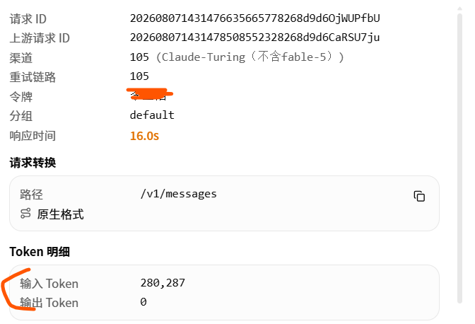

# 输出 Token 为 0：日志事实分析

本文只记录线上日志、线上配置、跨系统请求关联和受控测试已经支持的事实，不承载代码改造方案。当前实施方案见[客户侧超时 Token 对账最小方案](2026-08-08-客户侧超时Token对账最小方案.md)，修复后接口验收及剩余边界见[客户断开续读接口回归问题分析](2026-08-08-客户断开续读接口回归问题分析.md)；更宽的备选设计见[输出 Token 为 0：代码业务目标、问题分析与优化方案](2026-08-07-输出Token为0代码业务优化方案.md)。

本文统一使用以下链路角色：

- **客户侧**：调用网关的用户应用、CLI/SDK 及其所在网络或代理链路；
- **网关**：承接客户侧请求并转发上游的 API 网关；
- **上游**：网关转发请求的上游服务，本次可关联证据为 `api02.ananops.com`。

## 问题与目标

截至 2026-08-07 21:55，线上当日共有 175 条 `completion_tokens=0` 消费日志。`completion_tokens=0` 是网关最终落库的 Token 结果，不等价于“上游返回 0 字节”“请求失败”或“没有工具调用/推理输出”。

本文目标是固定事实边界：

1. 说明 175 条记录分别以何种传输状态结束；
2. 解释已关联 Claude 请求为什么在网关记录为 0；
3. 区分网关本地估算 Token、流中终态 usage 与上游账单 Token；
4. 列出尚不能由现有日志证明的结论；
5. 为后续代码方案提供可复现的验收基线。

本文只对齐 Token 数量及其语义分类，不对齐金额、单价、汇率或供应商成本。

## 修复后当前状态

2026-08-08 本地实现已经在客户侧结束后继续读取已建立的上游文本流。真实接口和消费日志复验确认：

- Claude Messages 在客户侧 1 秒超时且收到 0 字节后，网关继续取得输入 46、输出 18，消费日志同时记录 `end_reason=client_gone` 和 `upstream_result=terminal_success`，请求 ID 为 `202608080907410245190008268d9d6KruLjCiU`；
- 较早的 Claude 缓存复验在客户侧收到 0 字节后取得未缓存输入 30、缓存读取 25,004、输出 8，证明缓存和输出分项都能在断开后继续取得；
- OpenAI Responses 在客户侧终态前结束后取得输入 323、输出 12，不再固定落为全零 usage；
- Chat Completions、Claude Messages 和 OpenAI Responses 的 max-tokens 越界请求均返回 HTTP 400 `invalid_request`，不会以 5xx 触发客户端重试；
- `go test ./service ./controller ./relay/helper ./relay/channel/... ./relay` 与 `go build ./...` 均通过。

因此，以下 175 条统计、原关联请求和旧受控测试继续作为**修复前固定快照**使用，不能描述修复后请求的当前行为。修复后仍需按 `client_gone` 与独立 `upstream_result` 判断续读成功、失败或超时，不能只看 `completion_tokens`。

## 修复前固定快照

### 修复前核心结论

对原截图中已通过请求 ID 关联的 Claude 请求，以及修复前受控复现的 `client_gone + frt=-1000` 请求，网关输出 Token 为 0 的直接机制是：

> 客户侧等待边界先于首个有效上游 SSE 事件到达，客户侧请求 Context 结束；网关随后停止读取上游响应，Claude 流处理器没有获得可用输出和终态 usage，最终以空输出缓冲做本地补算，因此得到 `completion_tokens=0`。

完整链路如下：

```text
请求体上传/解析 + 网关转发 + 上游首事件延迟 + 回传耗时
  -> 端到端首事件时间超过客户侧等待边界
  -> 客户侧 Context 先结束
  -> 网关记录 client_gone 并关闭上游响应体
  -> 网关未消费上游已生成或随后生成的 SSE
  -> 网关没有终态 usage，text/thinking 缓冲为空
  -> 本地补算得到“估算输入 Token + 0 输出 Token”
```

该结论说明的是“为什么网关最终记为 0”，不是说上游真实输出为 0，也不是 Token 计数器把网关已经处理到的文本错误地算成了 0。

受控 12 秒取消已经证明该机制可以稳定复现；但 `client_gone` 本身只证明客户侧 Context 结束。没有对应客户侧日志时，不能把每条历史记录进一步写成“用户主动点击取消”或“某个 SDK 固定超时”。

### 175 条基线分型

这 175 条记录不是同一个根因，应按传输结束、协议完整性、输出类型和 Token 证据来源分别判断。

| 现象 | 数量 | 已确认 | 尚不能确认 |
| --- | ---: | --- | --- |
| Turing 上游族 `client_gone + frt<0` | 149 | 客户侧 Context 在网关处理首个有效 SSE `data:` 事件前结束；大上下文会拉长端到端首事件时间 | 每条历史请求由客户侧超时、网络断开还是其他取消触发 |
| 非 Turing `client_gone` | 16 | 其中 14 条 `frt<0`，2 条 `frt>=0` | 各渠道的具体触发原因 |
| Claude `eof + completion_tokens=0` | 6 | 网关识别过事件；本地 text/thinking 缓冲为空；使用本地输入估算 | 是否有纯 `tool_use`、是否收到 `message_stop`、协议是否完整 |
| Responses `eof + 全零 usage` | 4 | 网关识别过事件；未产生 Token 扣费 | 是否收到成功终态、终态 usage 是否缺失、是否只有 reasoning/tool 输出 |

其中 `client_gone` 共 165 条，163 条 `frt<0`，2 条 `frt>=0`；`eof` 共 10 条。

### 按模型、渠道和结束原因的日志统计

以下为 2026-08-07 21:55 的固定快照。`prompt_tokens` 是网关日志字段，其中异常请求可能来自本地估算，不代表流中终态或上游账单输入 Token。

| 模型 | 渠道 | 上游 | 结束原因 | 条数 | 网关日志 prompt_tokens | `frt<0` | 有上游请求 ID |
| --- | ---: | --- | --- | ---: | ---: | ---: | ---: |
| `claude-opus-4-8` | 116 | `api02.ananops.com` | `client_gone` | 68 | 25,510,330 | 68 | 68 |
| `claude-opus-4-8` | 105 | `api02.ananops.com` | `client_gone` | 57 | 16,982,825 | 57 | 57 |
| `glm-5.2` | 101 | `ext-tok.turing-agi.com` | `client_gone` | 10 | 5,396,038 | 10 | 10 |
| `deepseek-v4-pro` | 35 | DeepSeek 官方 | `client_gone` | 8 | 25,265 | 7 | 0 |
| `claude-fable-5` | 110 | `api02.ananops.com` | `eof` | 6 | 226,947 | 0 | 6 |
| `claude-opus-4-6` | 105 | `api02.ananops.com` | `client_gone` | 5 | 2,190,747 | 5 | 5 |
| `gpt-5.6-sol` | 72 | `p.lightingtheword.com` | `eof` | 4 | 0 | 0 | 0 |
| `claude-opus-4-8` | 79 | `midcode.cc` | `client_gone` | 4 | 331,999 | 4 | 4 |
| `gpt-5.5` | 72 | `p.lightingtheword.com` | `client_gone` | 4 | 0 | 3 | 0 |
| `claude-fable-5` | 111 | `api02.ananops.com` | `client_gone` | 3 | 232,962 | 3 | 3 |
| `deepseek-v4-flash` | 102 | `ext-tok.turing-agi.com` | `client_gone` | 3 | 1,147,841 | 3 | 3 |
| `claude-fable-5` | 110 | `api02.ananops.com` | `client_gone` | 2 | 130,441 | 2 | 2 |
| `gpt-5.5` | 106 | `api02.ananops.com` | `client_gone` | 1 | 0 | 1 | 1 |
| **合计** |  |  |  | **175** | **52,175,395** | **163** | **159** |

逐行复算后，网关日志 `prompt_tokens` 合计为 52,175,395，`frt<0` 和有上游请求 ID 的记录分别为 163 和 159。本文不使用内部 quota 或任何货币换算作为 Token 对齐证据。

原上下文分桶统计只有 3,475 条，而模型总请求数为 3,486，仍有 11 条未进入分桶；在补齐查询条件前，不能用该分桶比例完成正式归因。

### 日志字段的真实语义

| 观测值 | 真实含义 | 不能直接推出的结论 |
| --- | --- | --- |
| `client_gone` | `c.Request.Context().Done()` 已触发 | 用户主动点击取消；某个 SDK 必然超时 |
| `received=0` | 扫描器未处理到非空且符合 `data:` 格式的 SSE 数据事件 | HTTP/TCP 层必然返回 0 字节 |
| `frt=-1000` | `FirstResponseTime` 仍是初始化哨兵值 | 上游没有接收请求 |
| `upstream_request_id` 非空 | 网关从所识别的上游响应头取得请求 ID | 上游已完成生成；该 ID 对应的 Token 已是最终值 |
| `upstream_request_id` 为空 | 网关没有取得所识别的请求 ID 头 | 上游没有收到请求或没有返回响应头 |
| `local_count_tokens=true` | usage 至少有一部分由网关本地估算 | 上游返回了相同 usage |
| `end_reason=eof` | HTTP 响应体扫描干净结束 | 已收到协议成功终态或终态 usage |
| `usage_billing_path=upstream` | 修复前快照代码没有走本地标签且没有识别到结构化 BillingUsage 时的默认值 | 上游一定返回过非零 usage |

`http2: response body closed`、`file already closed` 等错误可能是网关在 `client_gone` 后主动关闭上游响应体的清理结果。它们不能单独证明上游主动断流。

### Responses 协议记录的事实边界

渠道 72 的 4 条 `gpt-5.6-sol` 使用 `/v1/responses`，日志均为：

- `stream_status.status=ok`；
- `stream_status.end_reason=eof`；
- `frt=565～2991ms`；
- `prompt_tokens=0`、`completion_tokens=0`；
- `usage_billing_path=upstream`；
- 没有 Token 扣费。

这 4 条不是 `client_gone`，可以排除“客户侧在首事件前结束”。但现有日志仍无法区分：

1. 已收到 `response.completed/response.done`，但终态 `response.usage` 缺失；
2. 只收到部分事件，未出现协议终态就 EOF；
3. 只有 reasoning、function call 或 custom tool 等非文本输出，现行本地降级统计未覆盖；
4. 存在终态 usage，但解析或结算链路丢失。

因此这 4 条只能归类为“Responses 终态或 usage 证据缺失”，不能描述为“完整成功且真实 0 Token”。GPT 当前基线共 9 条：渠道 72 的 `gpt-5.5` 4 条、`gpt-5.6-sol` 4 条，以及渠道 106 的 `gpt-5.5` 1 条；早期 8 条只是较早快照。

### 跨系统请求证据



网关日志的 `upstream_request_id` 与上游日志的请求 ID 均为：

```text
202608071431478508552328268d9d6CaRSU7ju
```

同一请求的 Token 记录如下：

| 系统 | 耗时 | 未缓存输入 | 缓存读取 | 缓存写入（5m） | 输出 | 证据结论 |
| --- | ---: | ---: | ---: | ---: | ---: | --- |
| 上游 `api02.ananops.com` | 13.0s，FRT 12.4s | 2 | 721,216 | 5,422 | 6 | 上游客户账单详情已形成按请求 ID 关联的分项 Token 记录 |
| 网关 | 16.0s | 本地 prompt 合计 280,287，未可靠拆分 | 未记录 | 未记录 | 0 | 网关没有取得终态 usage，并落入本地估算 |

该证据直接排除了“此请求上游记录的输出为 0”。它同时说明两端目前并非只差输出 Token：网关的本地 `prompt_tokens` 也不能替代上游的未缓存输入、缓存读取和缓存写入分项。

本文的业务目标是对齐上游最终计入客户账单的 Token，而不是证明上游内部 Token 算法具有物理意义上的绝对准确性。因此，这组截图值可以作为该请求的上游账单事实和人工核销基准；自动结算仍需确认账单详情接口、记录终态和稳定性。

#### 上游账单存在性与自动查询能力

必须区分两项能力：

1. **账单数据存在**：原关联截图已经确认。上游按请求 ID 展示未缓存输入、缓存读取、缓存创建和输出 Token，原关联请求具备人工核销条件；
2. **账单数据可稳定自动查询**：截至该快照尚未确认。当时只验证了 `/api/log/token`，没有验证截图页面实际使用的账单详情接口。

因此，准确结论不是“上游没有 Token”或“上游没有账本”，而是：

> 上游事后存在可关联的账单 Token；修复前网关在客户侧连接结束后没有从流中取得该 usage，当时尚缺对账程序可依赖的精确详情查询契约。

为匹配本业务目标，后续证据质量使用以下语义：

| 证据 | 含义 | 是否可作为 Token 对账值 |
| --- | --- | --- |
| `stream_confirmed` | 网关收到协议终态及完整 usage | 是 |
| `upstream_billed` | 上游最终客户账单按请求 ID 返回的 Token 分项 | 是 |
| `partial` | 只取得部分流事件或部分 usage | 否，只作为审计下界 |
| `estimated` | 网关或上游本地估算，未证明属于最终账单 | 否 |
| `missing` | 没有可用 Token 证据 | 否 |

`upstream_billed` 不要求上游证明其内部使用何种 tokenizer，但必须能确认记录属于最终账单、字段语义稳定且不会被后续估算值覆盖。

#### 本地 280,287 的计算机理

Claude 请求的本地输入 Token 不是 Anthropic 官方 tokenizer 结果。修复前快照代码会把 system、message、tool name、tool schema 等可识别内容拼成文本，再对 Claude 模型使用启发式估算：连续拉丁字母按一个单词权重计数，连续数字按一个数字段权重计数，并对图片、音频、文件使用固定或近似值。

该估算不理解上游 prompt cache 的读取/创建分项，也无法覆盖上游可能增加的模板、转换或隐藏内容。对代码、JSON、长标识符、工具 schema 和缓存请求出现显著低估，在机制上是可预期的。

在没有保存脱敏请求结构、实际转发体和上游转换记录的情况下，仍不能把 `280,287` 与上游展示输入分项之和的每一部分差异精确拆开。该未知项不影响“本地估算不能冒充流中终态或上游账单分项”的结论。

### 受控账号测试

测试通过上游和网关两个受控账号请求 `/v1/messages`，模型为 `claude-opus-4-8`。任何 API 密钥均不写入本文或仓库；因测试密钥曾在对话中明文出现，必须轮换。

#### 测试设计

| 测试类型 | 目的 | 边界 |
| --- | --- | --- |
| 非流式小请求 | 验证账号、模型和基础 usage | `max_tokens=16` |
| 流式小请求 | 验证完整 Claude 事件序列 | 固定输出 `OK` |
| 强制 `tool_use` | 验证纯工具输出和终态 usage | 固定工具名和参数，`max_tokens=64` |
| 上下文阶梯 | 验证首事件延迟及是否存在已声称的 100k 硬上限 | 实际 usage 为 20,018、100,018、280,018 输入 Token |
| 12 秒取消 | 可控复现首事件前客户侧 Context 结束 | 280k 输入；客户侧测试程序收到 0 字节后超时 |

每次测试记录 HTTP 状态、客户侧首事件时间、Claude 事件类型、终态 usage，并通过双方日志回查渠道、FRT、Token 和请求 ID。

#### 正常完成对照

| 场景 | 上游直连 | 网关 | 结论 |
| --- | --- | --- | --- |
| 非流式，16 输入 | 16/4，首响应 2.56s | 16/4，首响应 2.72s | 正常 |
| 流式，16 输入 | 16/4，首事件 2.05s | 16/4，首事件 2.79s | 均收到 `message_stop` |
| 强制 `tool_use` | 510/36，首事件 3.29s | 510/36，首事件 3.87s | 均有完整工具参数和终态 usage |
| 20,018 输入 | 20,018/4，首事件 4.18s | 20,018/4，首事件 5.82s | 正常 |
| 100,018 输入 | 100,018/4，首事件 8.07s | 100,018/4，首事件 8.34s | 正常 |
| 280,018 输入 | 280,018/4，客户侧首事件 20.96s，上游 FRT 10.93s | 280,018/4，客户侧首事件 13.11s，网关 FRT 11.23s | 客户侧继续等待时，两端均可完整成功 |

280k 直连测试中，客户侧首事件为 20.96s，上游日志 FRT 为 10.93s。差值说明端到端等待还包含请求体上传、入口解析、网络传输和中间转发；仅看服务端 FRT 不能判断客户侧是否会先结束。

正常完成结果也证明“超过 100k 必然失败”不成立。渠道保护应依据端到端首事件延迟分布和客户侧等待边界，而不是把 100k 写成硬能力上限。

#### 12 秒取消复现

相同的 280k 请求在持续等待时返回 280,018 输入和 4 输出；将客户侧测试程序等待上限设为 12 秒后，网关入口和上游直连都能复现“收到 0 字节后超时”。

| 链路 | 客户侧结果 | 日志结果 | 本地 prompt | completion |
| --- | --- | --- | ---: | ---: |
| 通过网关 | 12.01s 超时，0 字节 | 网关渠道 116，`frt=-1000`，有上游请求 ID | 212,810 | 0 |
| 直连上游 | 12.00s 超时，0 字节 | 上游渠道 57，`client_gone/context canceled`，`frt=-1000` | 212,810 | 0 |

关联 ID：

| 系统 | 本级请求 ID | 上游请求 ID |
| --- | --- | --- |
| 网关 | `202608071501121638481498268d9d6uWbc8N6y` | `202608071501122759401558268d9d6hBSer8tq` |
| 上游测试账号 | `202608071503079024775208268d9d6fpsUdPvN` | `202608071503082855618818268d9d6iSQSVfqv` |

正常完成的终态输入 usage 为 280,018；取消日志的本地 prompt 为 212,810，少 67,208，约 24%。这证明取消日志里的 212,810 是本地估算，不是可用于两端对账的终态或上游账单 usage。24% 只描述该受控样本，不能外推为原始关联请求或其他内容结构的估算误差界。

#### 渠道路由新证据

网关受控请求实际命中：

- 小请求：渠道 105；
- 100k 和 280k 请求：渠道 116。

上游测试账号实际命中：

- 小请求：渠道 81；
- 100k 和 280k 请求：渠道 57。

因此“网关已下线该渠道”与实际路由结果不一致。必须核对数据库渠道状态、模型映射、多实例配置、渠道选择缓存和 token/channel affinity，不能用控制台展示状态代替实际路由证据。

#### 协议覆盖与账单查询能力验证

使用同一组受控账号执行最小输出请求和 1 秒客户侧取消，对 Claude 原生、OpenAI Chat 兼容和 OpenAI Responses 三个入口进行对照。测试密钥未写入仓库或文档。

| 入口 | 链路 | 结果 | Token/终态证据 | 结论 |
| --- | --- | --- | --- | --- |
| `/v1/messages`，`claude-opus-4-8` | 上游直连 | 200，输出 `OK` | `input=14/output=4` | Claude 原生正常 |
| `/v1/messages`，`claude-opus-4-8` | 通过网关 | 200，输出 `OK` | `input=14/output=4` | 网关正常透传 Claude usage |
| `/v1/chat/completions`，`claude-opus-4-8` | 上游与网关 | 均为 200，输出 `OK` | `prompt=14/completion=4`，响应中 `usage_source=anthropic`、`billing_usage.source=claude_messages` | 只是 Claude Messages 的 OpenAI 表面转换，不是第二套核销生命周期 |
| `/v1/responses`，`claude-opus-4-8` | 上游与网关 | 均为 500 `convert_request_failed/not implemented` | 无 usage | 当前不能用 Claude 模型模拟 Responses 消费者 |
| `/v1/responses`，`gpt-5.6-sol` | 通过网关，非流式 | 200 `completed` | `input=305/output=5` | Responses 正常终态 usage 可用 |
| `/v1/responses`，`gpt-5.6-sol` | 通过网关，流式 | 200，收到 `response.created` 和 `response.completed` | 终态 `input=305/output=5` | Responses 有独立协议终态 |
| `/v1/responses`，`gpt-5.6-sol` | 通过网关，1 秒取消 | 客户侧 0 字节、curl 28 | 网关落 `type=2`、`prompt=0/completion=0`、`frt=-1000`，缺少协议终态和 usage 证据 | 已确认第二个真实消费者存在同类“异常结束仍写成功消费日志”问题 |
| `/v1/messages`，`claude-opus-4-8` | 上游直连，1 秒取消 | 客户侧 0 字节、curl 28 | 延迟落库 `client_gone`、本地 `prompt=19/completion=0` | 上游现有日志也会在取消时使用本地估算 |

关键请求 ID：

| 场景 | 请求 ID |
| --- | --- |
| GPT Responses 正常流式 | `202608071609100920693058268d9d6qbfVhRQV` |
| GPT Responses 1 秒取消 | `202608071609320895186948268d9d6vME5ngIc` |
| 上游 Claude 1 秒取消 | `202608071609582129416708268d9d6fzScYIb3` |

上游 `/api/log/token` 的受控验证结果：

- API Key 可以读取本 Token 的最近日志；
- 返回结构包含本级 `request_id`、汇总 Token 和 `other`，但不包含可用的 `upstream_request_id`、`actual/estimated/missing` 或 `final`；
- 添加 `request_id` 查询参数后仍返回完整最近日志列表，未执行精确过滤；
- 客户侧发送自定义 `X-Oneapi-Request-Id` 后，上游仍生成新的本级请求 ID，没有保留该值；
- 1 秒取消请求最终记录为本地 `19/0`，证明该接口返回的 Token 不保证属于上游最终账单分项。

因此现有 `/api/log/token` 是面向 Token 的最近日志接口，不满足精确核销所需的请求级账单详情契约。这个结论只否定该接口的自动核销能力，不否定截图已经证明的上游账单数据存在。下一步应验证截图页面实际调用的详情接口；若要处理响应头前取消，仍需上游新增或明确支持请求发出前的稳定客户关联 ID。

### 已确认事实与待验证边界

| 判断 | 状态 | 说明 |
| --- | --- | --- |
| 已关联 Claude 请求的上游账单输出不是 0 | 已确认 | 同一上游请求 ID 下，上游记录输出 6，网关记录 0 |
| 上游存在按请求 ID 关联的分项账单 Token | 已确认 | 原截图包含未缓存输入、缓存读取、缓存创建和输出，可作为该请求人工核销基准 |
| 上游请求 ID 可以作为确定性核销关联键 | 已确认 | 原关联请求已按同一 ID 匹配；其他请求仍需先取得对应上游账单记录 |
| 客户侧等待边界可造成相同的 0 输出机制 | 已确认 | 280k 请求配合 12 秒客户侧上限可稳定复现 |
| 280k 请求在当前路由上可以正常完成 | 已确认 | 持续等待时收到完整 `message_stop` 和 usage |
| 历史 149 条全部由同一个 SDK 自定义超时造成 | 未确认 | 缺少每条客户侧日志；`client_gone` 不能证明具体触发方 |
| Claude 6 条 EOF 是完整空响应 | 未确认 | 需要原始 SSE 事件类型和协议终态 |
| Responses 4 条 EOF 是完整成功 | 未确认 | 需要终态、usage 和非文本输出证据 |
| `/api/log/token` 中的 Token 都属于最终账单值 | 未确认 | 12 秒直连取消样本也出现本地估算，不能把该接口所有记录标为 `upstream_billed` |
| 当前 `/api/log/token` 可作为请求级最终账单详情接口 | 已否定 | 实测无精确过滤、无客户关联 ID，取消记录为本地估算 |
| 截图页面的账单详情接口可供程序精确查询 | 未确认 | 尚未检查页面网络请求、认证方式、终态、分页、保留期和字段稳定性 |
| 响应头前取消的上游账单可与网关请求关联 | 未确认 | 上游未保留测试中预置的客户关联 ID，网关此时可能拿不到上游请求 ID |
| Responses 是第二个真实核销消费者 | 已确认 | GPT Responses 1 秒取消后落 `type=2`、全零 Token，缺少终态和 usage 证据 |
| 已下线渠道仍被命中的具体原因 | 未确认 | 需核对数据库、缓存、多实例和亲和性 |

## 优化方案

事实文档不定义代码或计费改造。上线前需要收口的证据工作如下，完成后只更新对应事实，不追加过程流水账：

1. 保存可重现 175 条基线的脱敏 SQL、时区、业务日边界、join 和去重规则；
2. 解释 3,475 条上下文分桶与 3,486 条模型总请求之间的 11 条差异；
3. 全量核对 2 条 `client_gone + frt>=0`、6 条 Claude EOF、4 条 Responses EOF 和 16 条非 Turing `client_gone`；
4. 记录协议终态、输出类型和 Token 证据来源，不再只依赖 `eof` 或 `completion_tokens=0`；
5. 检查截图页面实际使用的账单详情接口，确认按请求 ID 精确查询、认证方式、Token 分项、记录终态、更新时间、分页和保留期；
6. 确认上游账单中的缓存读取、缓存创建和输出字段语义，以及记录是否可能被后续修订；
7. 查明已下线渠道仍被受控请求命中的配置路径；
8. 对需要定性为“客户侧超时”的历史请求，用同一追踪 ID 对齐客户侧/SDK 日志。

在这些证据补齐前，本文保持以下表述纪律：

- `client_gone` 写为“客户侧 Context 结束”，不直接写“用户主动取消”；
- `frt<0` 写为“网关未处理到有效 SSE 事件”，不写“上游返回 0 字节”；
- 本地估算 Token 不写成流中终态 usage 或上游账单 Token；
- 传输 EOF 不写成协议完整成功；
- 只对齐 Token 分项，不引入金额对账结论。
